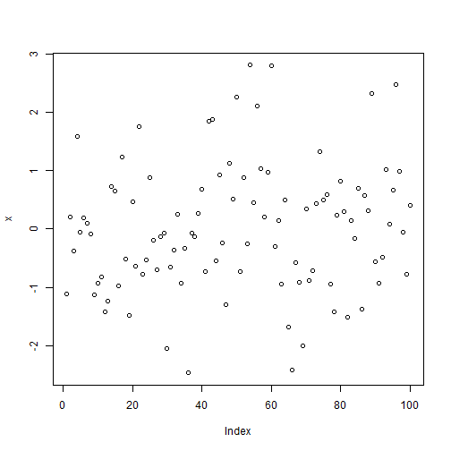
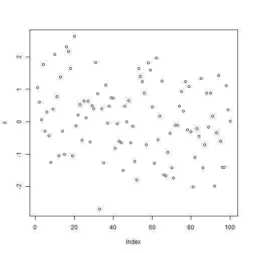
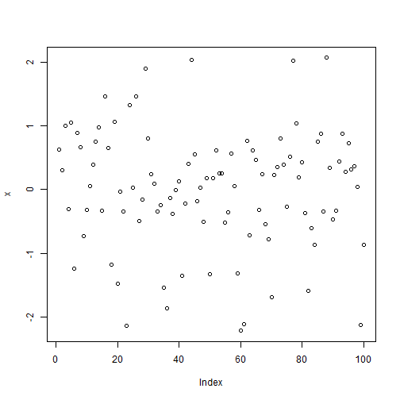
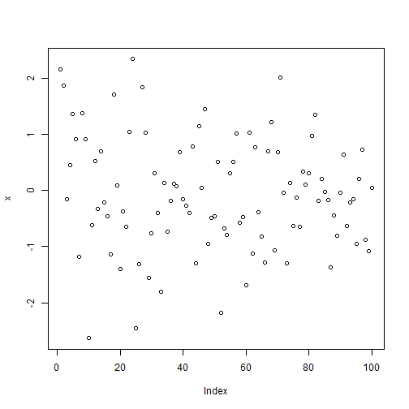

####SRT Assignment 0
####Alfred Szutu

####Introduction to R
(ref:https://www.r-project.org/about.html)
R is a programming language and environment for statistical computing and graphics. Statistical and graphical techniques can be applied to do calculations,
plot graphs, analyze data, etc. 

####ToDo 1
Compute the diference between 2014 and the
year  you  started at this university and divide
this by the diference between 2014 and the year
you  were  born. Multiply this with 100  to get
the  percentage of your life you have spent at
this university. Use brackets if you need them.

```r
   (2016-2014)/(2016-1994)*100
```

```
## [1] 9.090909
```


####ToDo2
Repeat the previous ToDo, but with several
steps in between. You can give the variables
any name you want, but the name has to start
with a letter.

```r
currentyear <- 2016
startyear <- 2014
birthyear <- 1994
diff_a <- currentyear-startyear
diff_b <- currentyear-birthyear
perentage <- diff_a/diff_b
life_spent <- perentage*100
life_spent
```

```
## [1] 9.090909
```

####ToDo3
Compute the sum of 4, 5, 8 and 11 by first
combining  them  into  a  vector  and
then  using  the function sum.

```r
   v=c(4,5,8,11)
   sum(v)
```

```
## [1] 28
```

####ToDo4
Plot 100 normal random numbers.

```r
   x=rnorm(100)
   plot(x)
```



####ToDo5
Find help for the sqrt function.

```r
   help(sqrt)
```

####ToDo6
Make a file called firstscript. R containing
R code  that generates 100  random  numbers  and
plots them, and run this script several times.

```r
   source("C:/Users/aszut/Documents/Github/SRT-assignment-0/firstscript.R")
```


```r
   source("C:/Users/aszut/Documents/Github/SRT-assignment-0/firstscript.R")
```


```r
   source("C:/Users/aszut/Documents/Github/SRT-assignment-0/firstscript.R")
```



```r
   source("C:/Users/aszut/Documents/Github/SRT-assignment-0/firstscript.R")
```


```r
   source("C:/Users/aszut/Documents/Github/SRT-assignment-0/firstscript.R")
```



```r
   source("C:/Users/aszut/Documents/Github/SRT-assignment-0/firstscript.R")
```



```r
   source("C:/Users/aszut/Documents/Github/SRT-assignment-0/firstscript.R")
```


####ToDo7
Put  the  numbers  31  to  60  in  a  vector  named
P and in a matrix with 6 rows and 5 columns named Q.

```r
   p=matrix(data=c(seq(from=31, to=60, by=1)),ncol=5)
   colnames(p)[1:5] <- "Q"
   p
```

```
##       Q  Q  Q  Q  Q
## [1,] 31 37 43 49 55
## [2,] 32 38 44 50 56
## [3,] 33 39 45 51 57
## [4,] 34 40 46 52 58
## [5,] 35 41 47 53 59
## [6,] 36 42 48 54 60
```

####ToDo8
Make  a  script  le  which  constructs  three  random  normal  vectors  of  length  100. Call  these vectors x1, x2 and x3. Make a data frame called t with three columns (called a, b and c) containing  respectively x1, x1+x2 and x1+x2+x3. Call the following functions for this data frame:
plot(t) and sd(t).

```r
   source("C:/Users/aszut/Documents/Github/SRT-assignment-0/test.R")
   a=x1
   b=x1+x2
   c=x1+x2+x3
   t=data.frame(a,b,c)
   plot(t)
```


```r
   sd(t)
```

```
## Error in is.data.frame(x): (list) object cannot be coerced to type 'double'
```
Cannot do standard deviation for the vector

####ToDo9
what the meaning is of rgb, 
the last argument of rgb,lwd,pch,cex.

```r
   help(rgb)
```
RGB gives intensities to the colours red, green, and blue respectively.
The values lie between 0 and 1 and provide a seperate r,g,b vector
(three-column matrix) passed as R. The 4th vector (alpha) determines
opacity between 0 and 1, where 0 is fully transparent and 1 is opaque.

####ToDo10
Make  a  file  called tst1.txt in  Notepad  from
the  example  in  Figure  4  and  store  it  in  your
working directory.  Write a script to read it, to
multiply the column called g by 5 and to store
it as tst2.txt.

```r
   d = read.table(file="C:/Users/aszut/Documents/Github/SRT-assignment-0/tst1.txt",header=TRUE)
   d[2]=d[2]*5
   d2 = data.frame(d)
   write.table(d2,file="C:/Users/aszut/Documents/Github/SRT-assignment-0/tst2.txt",row.names=FALSE)
```

####ToDo11
Compute the mean of the square root of a vec-
tor  of  100  random  numbers.   What  happens?

```r
   sroot=data.frame=sample(100)
   sqrt(sroot)
```

```
##   [1]  5.830952  8.717798  2.828427  8.888194  7.483315  4.690416  4.000000
##   [8]  4.582576  6.082763  6.480741  9.110434  6.782330  7.211103  8.306624
##  [15]  8.602325  9.055385  3.162278  1.414214  8.660254  9.797959  6.855655
##  [22]  8.774964  8.366600  3.741657  7.810250  4.898979  7.874008  9.899495
##  [29]  8.544004  9.746794  6.244998  2.449490  3.464102  6.403124  9.643651
##  [36]  6.000000  8.246211  9.591663  9.165151  3.872983  7.280110  5.196152
##  [43]  9.000000  5.567764  5.000000  4.123106  8.831761  8.185353  7.745967
##  [50]  5.477226  6.633250  7.141428  9.949874  5.099020  7.000000  3.605551
##  [57]  8.426150  6.557439  8.124038 10.000000  7.071068  7.549834  6.324555
##  [64]  9.433981  9.380832  2.645751  5.744563  8.062258  6.164414  6.928203
##  [71]  3.316625  7.615773  7.416198  4.472136  7.348469  9.273618  9.695360
##  [78]  2.236068  7.937254  4.242641  8.944272  6.708204  1.732051  5.291503
##  [85]  9.327379  5.385165  1.000000  9.539392  7.681146  4.795832  5.656854
##  [92]  9.486833  2.000000  4.358899  9.219544  8.000000  8.485281  3.000000
##  [99]  5.916080  9.848858
```

####ToDo12
Make  a  graph  with  on  the  x-axis:  today,  Sin-
terklaas  2014  and  your  next  birthday  and  on
the y-axis the number of presents you expect on
each of these days

```r
   m <- c(strptime(c("20141206","20161110"),format="%Y%m%d"))
   n <- c(1,5)
   plot(m,n,main="Number of presents vs date",xlab="Date",ylab="# of presents")
```


####ToDo13
Make a vector from 1 to 100.  Make a for-loop
which runs through the whole vector.  Multiply
the elements which are smaller than 5 and larger
than 90 with 10 and the other elements with 0.1.

```r
   h=1:100
   values=c()
   for(i in h)
   {
     if(i <= 5)
     {values[i]=h[i]*10}
     else if(i >= 90)
     {values[i]=h[i]*10}
     else
     {values[i]=h[i]*0.1}
   }
   values
```

```
##   [1]   10.0   20.0   30.0   40.0   50.0    0.6    0.7    0.8    0.9    1.0
##  [11]    1.1    1.2    1.3    1.4    1.5    1.6    1.7    1.8    1.9    2.0
##  [21]    2.1    2.2    2.3    2.4    2.5    2.6    2.7    2.8    2.9    3.0
##  [31]    3.1    3.2    3.3    3.4    3.5    3.6    3.7    3.8    3.9    4.0
##  [41]    4.1    4.2    4.3    4.4    4.5    4.6    4.7    4.8    4.9    5.0
##  [51]    5.1    5.2    5.3    5.4    5.5    5.6    5.7    5.8    5.9    6.0
##  [61]    6.1    6.2    6.3    6.4    6.5    6.6    6.7    6.8    6.9    7.0
##  [71]    7.1    7.2    7.3    7.4    7.5    7.6    7.7    7.8    7.9    8.0
##  [81]    8.1    8.2    8.3    8.4    8.5    8.6    8.7    8.8    8.9  900.0
##  [91]  910.0  920.0  930.0  940.0  950.0  960.0  970.0  980.0  990.0 1000.0
```

####ToDo14
Write  a  function  for  the  previous  ToDo,  so
that   you   can   feed   it   any   vector   you   like
(as  argument).    Use  a  for-loop  in  the  func-
tion  to  do  the  computation  with  each  ele-
ment.

```r
fun=function(arg1,arg2)
{
  h=arg1:arg2
  values=c()
  for(i in h)
  {
    if(i <= 5)
    {values[i]=h[i]*10}
    else if(i >= 90)
    {values[i]=h[i]*10}
    else
    {values[i]=h[i]*0.1}
  }
  values
}
fun(arg1=1,arg2=100)
```

```
##   [1]   10.0   20.0   30.0   40.0   50.0    0.6    0.7    0.8    0.9    1.0
##  [11]    1.1    1.2    1.3    1.4    1.5    1.6    1.7    1.8    1.9    2.0
##  [21]    2.1    2.2    2.3    2.4    2.5    2.6    2.7    2.8    2.9    3.0
##  [31]    3.1    3.2    3.3    3.4    3.5    3.6    3.7    3.8    3.9    4.0
##  [41]    4.1    4.2    4.3    4.4    4.5    4.6    4.7    4.8    4.9    5.0
##  [51]    5.1    5.2    5.3    5.4    5.5    5.6    5.7    5.8    5.9    6.0
##  [61]    6.1    6.2    6.3    6.4    6.5    6.6    6.7    6.8    6.9    7.0
##  [71]    7.1    7.2    7.3    7.4    7.5    7.6    7.7    7.8    7.9    8.0
##  [81]    8.1    8.2    8.3    8.4    8.5    8.6    8.7    8.8    8.9  900.0
##  [91]  910.0  920.0  930.0  940.0  950.0  960.0  970.0  980.0  990.0 1000.0
```

####Footnote
The  ToDo  above  can  be  done  more  easily
and quickly without a for-loop but with regular vector-
computations.

```r
fun2=function(arg1,arg2)
{
  values <- arg1:arg2
  if(length(values)>1)
  {
    values[c(seq(from=5,to=90))]=values[c(seq(from=5,to=90))] * 0.1
    values[c(seq(from=arg1,to=5))]=values[c(seq(from=arg1,to=5))] * 10
    values[c(seq(from=90,to=arg2))]=values[c(seq(from=90,to=arg2))] *10
  }
  values
}
fun2(arg1=1,arg2=105)
```

```
##   [1]   10.0   20.0   30.0   40.0    5.0    0.6    0.7    0.8    0.9    1.0
##  [11]    1.1    1.2    1.3    1.4    1.5    1.6    1.7    1.8    1.9    2.0
##  [21]    2.1    2.2    2.3    2.4    2.5    2.6    2.7    2.8    2.9    3.0
##  [31]    3.1    3.2    3.3    3.4    3.5    3.6    3.7    3.8    3.9    4.0
##  [41]    4.1    4.2    4.3    4.4    4.5    4.6    4.7    4.8    4.9    5.0
##  [51]    5.1    5.2    5.3    5.4    5.5    5.6    5.7    5.8    5.9    6.0
##  [61]    6.1    6.2    6.3    6.4    6.5    6.6    6.7    6.8    6.9    7.0
##  [71]    7.1    7.2    7.3    7.4    7.5    7.6    7.7    7.8    7.9    8.0
##  [81]    8.1    8.2    8.3    8.4    8.5    8.6    8.7    8.8    8.9   90.0
##  [91]  910.0  920.0  930.0  940.0  950.0  960.0  970.0  980.0  990.0 1000.0
## [101] 1010.0 1020.0 1030.0 1040.0 1050.0
```

####Document references
https://cran.r-project.org/doc/contrib/Torfs+Brauer-Short-R-Intro.pdf
http://nicercode.github.io/guides/reports/
http://kbroman.org/knitr_knutshell/pages/Rmarkdown.html

use of help() to understand topics and packages.
